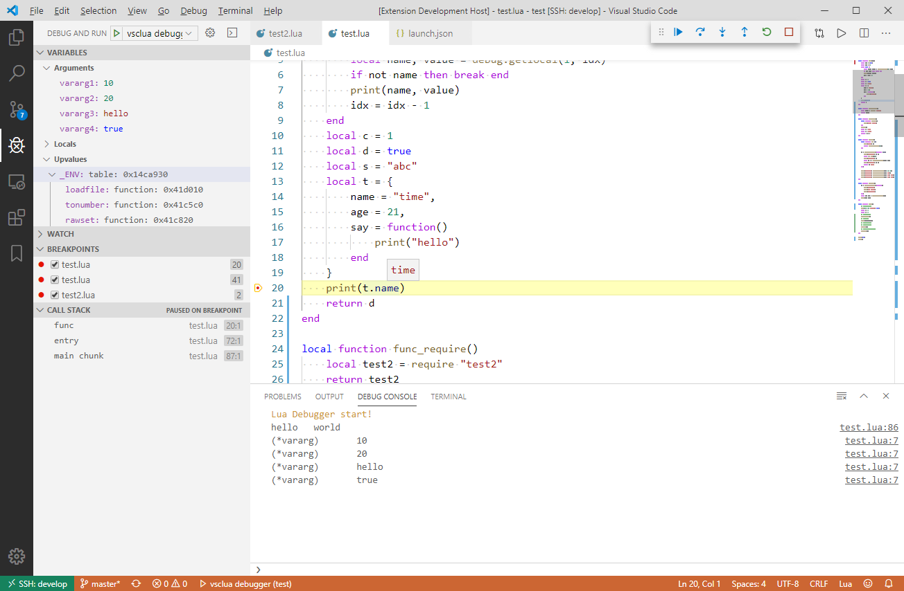
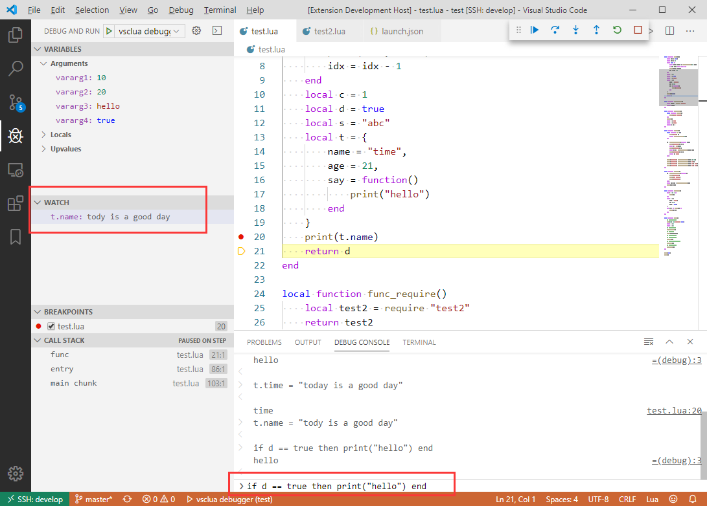

# vscluadbg

Lua 5.3 Debug Adapter for VSCode

# Features

- [x] breakpoints 
    - [x] log breakpoints
    - [x] condition breakpoints 
    - [x] hit condition breakpoints 
- [x] step over, step in, step out
- [x] call stack
- [x] show arguments, locals, upvalues
- [x] print redirect to vscode console
- [x] evaluate
- [x] watch

# snapshot

- breakpoints

- watch and evaluate

