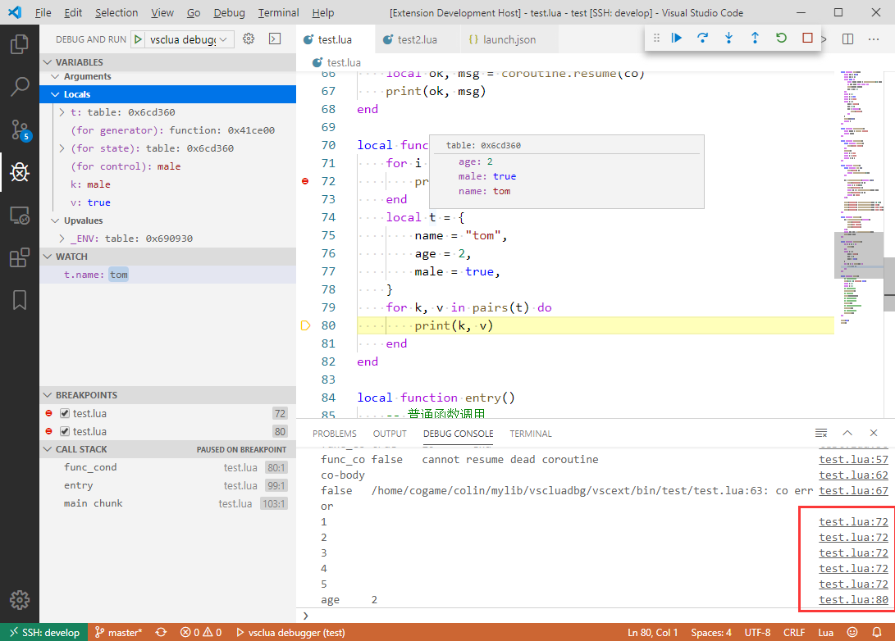

# vscluadbg

Lua 5.3 Debug Adapter for VSCode

# Features

- [x] breakpoints
- [x] log breakpoints
- [x] step over, step in, step out
- [x] call stack
- [x] show arguments, locals, upvalues
- [x] print redirect to vscode console
- [ ] evaluate
- [ ] watch
- [ ] condition breakpoints 

# snapshot

